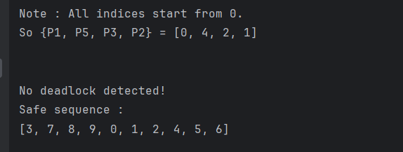

# Deadlock Detection Using Python

## Overview 

This project implements a deadlock detection algorithm using the Banker's algorithm. 
It simulates resource allocation and request processes to identify potential deadlocks in a system. 
The project is designed to help understand and detect deadlocks in resource allocation scenarios, 
making it useful for educational purposes and practical applications in operating systems and concurrent programming.

## Features
- **Read and Process Input Data**: Reads allocation, available, and request data from CSV files.
- **Dimension Check**: Verifies that the dimensions of the input data are compatible.
- **Deadlock Detection**: Uses the Banker's algorithm to detect deadlocks and provide a safe sequence if no deadlock is found.
- **Output Results**: Clearly prints whether a deadlock is detected and lists the deadlocked processes or the safe sequence.

## Files

- ```Allocation.csv```: Represents the NxM allocation matrix.
- ```Request.csv```: Represents the NxM request matrix.
- ```Available.csv```: Represents the M available vector.

## Dependencies
- Python 3.x
- pandas (for reading CSV files)
- numpy (for numerical operations)

## Installation
1. Clone the repository:
```bash
git clone https://github.com/yazan6546/Deadlock-Detection-Using-Python.git
```
2. Navigate to the project directory:
```bash
cd Deadlock-Detection-Using-Python
```
3. Install the required dependencies:
```bash
pip install -r requirements.txt
```

## Usage 

1. Place your ```Allocation.csv```, ```Available.csv```, and ```Request.csv``` files in the Inputs directory.
2. Ensure the CSV files are formatted correctly, with the appropriate data.
3. Use the provided functions to read the input data, check dimensions, and detect deadlocks.

## Code Structure
- ```read_file()```: Reads and processes allocation, available, and request data from CSV files.
- ```check_dimensions(allocation, available, request)```: Checks if the dimensions of the allocation, available, and request arrays are compatible.
- ```deadlock_detect(allocation, available, request)```: Detects deadlock in a system using the Banker's algorithm and prints the result.

## Example CSV Content

### Allocation.csv
| Process | ResourceA | ResourceB | ResourceC | ResourceD | ResourceE |
|---------|-----------|-----------|-----------|-----------|-----------|
| P1      | 5         | 6         | 0         | 3         | 1         |
| P2      | 1         | 0         | 6         | 5         | 4         |
| P3      | 2         | 4         | 1         | 0         | 2         |
| P4      | 4         | 3         | 2         | 0         | 4         |
| P5      | 6         | 2         | 3         | 2         | 2         |
| P6      | 1         | 1         | 3         | 2         | 3         |
| P7      | 0         | 0         | 5         | 1         | 1         |
| P8      | 0         | 5         | 7         | 3         | 0         |
| P9      | 2         | 6         | 0         | 5         | 0         |
| P10     | 3         | 7         | 1         | 6         | 2         |


### Request.csv

| Process | ResourceA | ResourceB | ResourceC | ResourceD | ResourceE |
|---------|-----------|-----------|-----------|-----------|-----------|
| P1      | 2         | 0         | 4         | 5         | 5         |
| P2      | 3         | 4         | 2         | 2         | 3         |
| P3      | 0         | 3         | 3         | 4         | 4         |
| P4      | 1         | 2         | 1         | 1         | 2         |
| P5      | 3         | 1         | 4         | 4         | 1         |
| P6      | 2         | 5         | 5         | 3         | 4         |
| P7      | 0         | 3         | 2         | 2         | 3         |
| P8      | 2         | 2         | 1         | 1         | 2         |
| P9      | 3         | 1         | 6         | 0         | 1         |
| P10     | 5         | 0         | 3         | 3         | 4         |


### Available.csv

| ResourceA | ResourceB | ResourceC | ResourceD | ResourceE |
|-----------|-----------|-----------|-----------|-----------|
| 2         | 0         | 2         | 1         | 3         |


## Example Output


